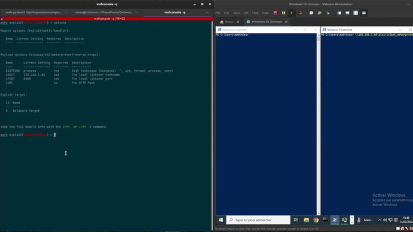

# CrimsonEDR

```
   _____                                  ______ _____  _____
  / ____|    (_)                         |  ____|  __ \|  __ \
 | |     _ __ _ _ __ ___  ___  ___  _ __ | |__  | |  | | |__) |
 | |    | '__| | '_ ` _ \/ __|/ _ \| '_ \|  __| | |  | |  _  /
 | |____| |  | | | | | | \__ \ (_) | | | | |____| |__| | | \ \
  \_____|_|  |_|_| |_| |_|___/\___/|_| |_|______|_____/|_|  \_\

                 Developed by : Matthias Ossard
                                https://github.com/Helixo32
```

CrimsonEDR is an open-source project engineered to identify specific malware patterns, offering a tool for honing skills in circumventing Endpoint Detection and Response (EDR) systems. By leveraging diverse detection methods, it empowers users to deepen their understanding of security evasion tactics.

## Features

| Detection                                   | Description                                                                                       |
|---------------------------------------------|---------------------------------------------------------------------------------------------------|
| Direct Syscall                    | Detects the usage of direct system calls, often employed by malware to bypass traditional API hooks.|
| NTDLL Unhooking                  | Identifies attempts to unhook functions within the NTDLL library, a common evasion technique.       |
| AMSI Patch                | Detects modifications to the Anti-Malware Scan Interface (AMSI) through byte-level analysis.        |
| ETW Patch                 | Detects byte-level alterations to Event Tracing for Windows (ETW), commonly manipulated by malware to evade detection. |
| PE Stomping                       | Identifies instances of PE (Portable Executable) stomping. |
| Reflective PE Loading             | Detects the reflective loading of PE files, a technique employed by malware to avoid static analysis. |
| Unbacked Thread Origin            | Identifies threads originating from unbacked memory regions, often indicative of malicious activity. |
| Unbacked Thread Start Address     | Detects threads with start addresses pointing to unbacked memory, a potential sign of code injection. |
| Custom Pattern Search                      | Allows users to search for specific patterns provided in a JSON file, facilitating the identification of known malware signatures. |


## Installation

To get started with CrimsonEDR, follow these steps:

1. Install dependancy:
    ```bash
    sudo apt-get install gcc-mingw-w64-x86-64
    ```
2. Clone the repository:
   ```bash
   git clone https://github.com/Helixo32/CrimsonEDR
   ```
3. Compile the project:
   ```bash
   cd CrimsonEDR;
   chmod +x compile.sh;
   ./compile.sh
   ```

## Usage

To use CrimsonEDR, follow these steps:

1.  Make sure the `ioc.json` file is in the current directory. Currently, `ioc.json` contains patterns related to `msfvenom`. You can easily add your own in the following format:
```
{
  "IOC": [
    ["0x03", "0x4c", "0x24", "0x08", "0x45", "0x39", "0xd1", "0x75"],
    ["0xf1", "0x4c", "0x03", "0x4c", "0x24", "0x08", "0x45", "0x39"],
    ["0x58", "0x44", "0x8b", "0x40", "0x24", "0x49", "0x01", "0xd0"],
    ["0x66", "0x41", "0x8b", "0x0c", "0x48", "0x44", "0x8b", "0x40"],
    ["0x8b", "0x0c", "0x48", "0x44", "0x8b", "0x40", "0x1c", "0x49"],
    ["0x01", "0xc1", "0x38", "0xe0", "0x75", "0xf1", "0x4c", "0x03"],
    ["0x24", "0x49", "0x01", "0xd0", "0x66", "0x41", "0x8b", "0x0c"],
    ["0xe8", "0xcc", "0x00", "0x00", "0x00", "0x41", "0x51", "0x41"]
  ]
}
```

2. Execute `CrimsonEDRPanel.exe` with the following arguments:

    - `-d <path_to_dll>`: Specifies the path to the `CrimsonEDR.dll` file.
    
    - `-p <process_id>`: Specifies the Process ID (PID) of the target process where you want to inject the DLL.

For example:

```bash
.\CrimsonEDRPanel.exe -d C:\Temp\CrimsonEDR.dll -p 1234
```


## Useful Links

Here are some useful resources that helped in the development of this project:

- [Windows Processes, Nefarious Anomalies, and You](https://pre.empt.blog/2023/windows-processes-nefarious-anomalies-and-you)
- [MalDev Academy](https://maldevacademy.com/)


## Contact

For questions, feedback, or support, please reach out to me via:

- **Discord**   : helixo32
- **LinkedIn**  : [Matthias Ossard](https://www.linkedin.com/in/matthias-ossard/)

